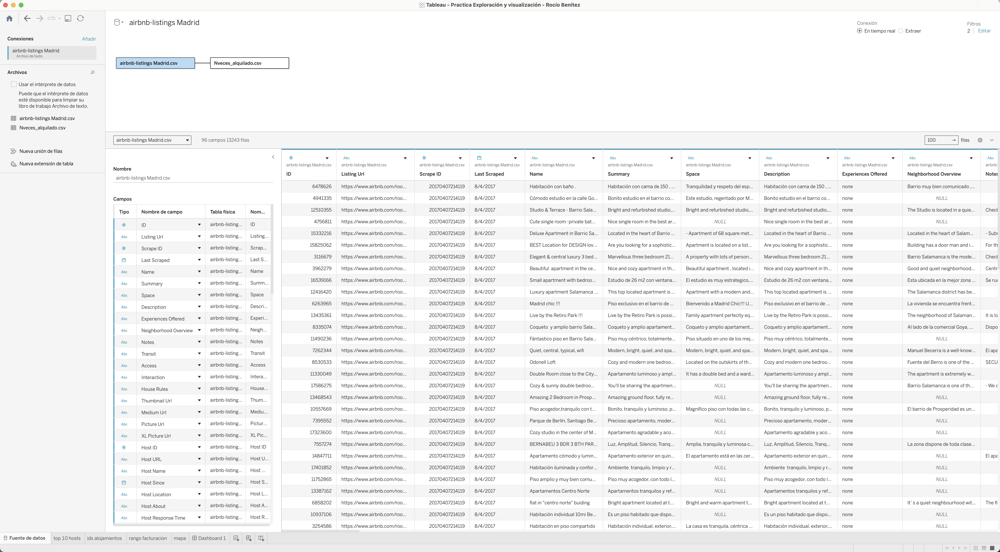
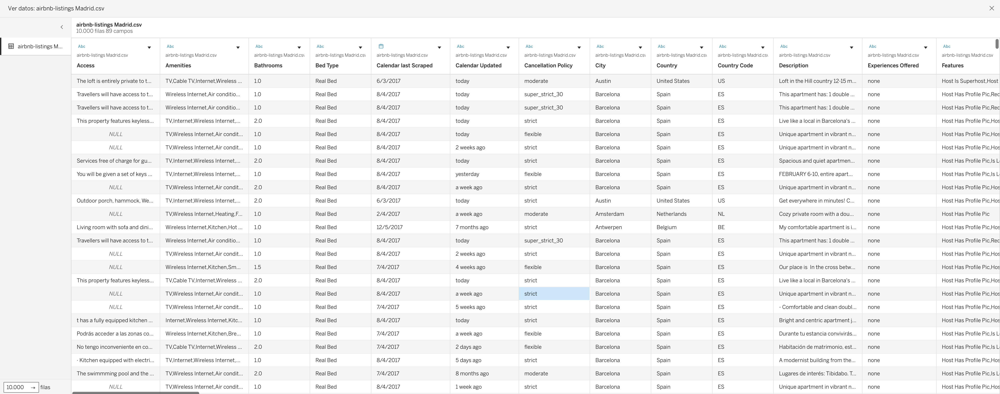
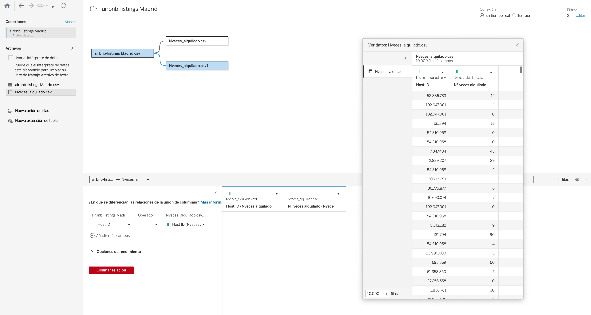
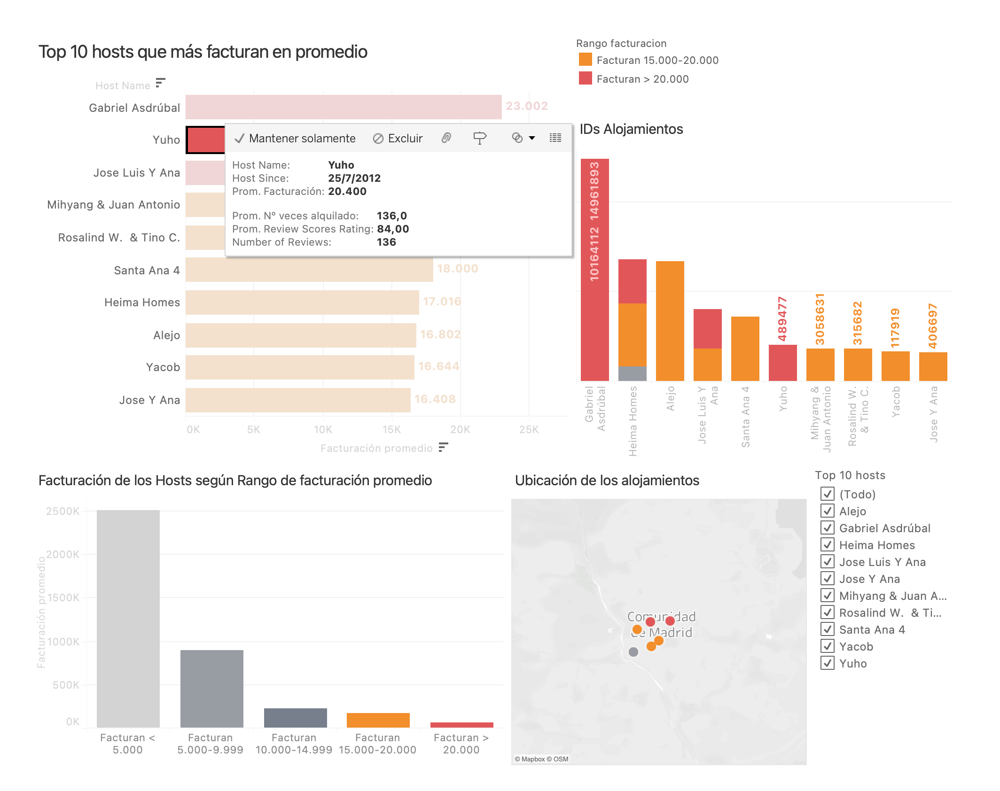
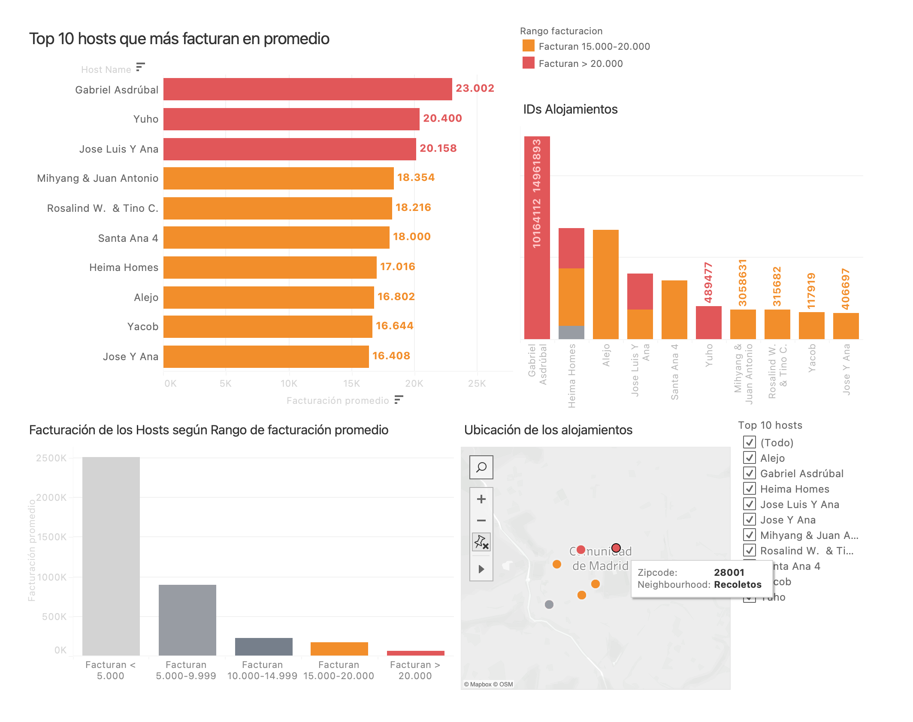
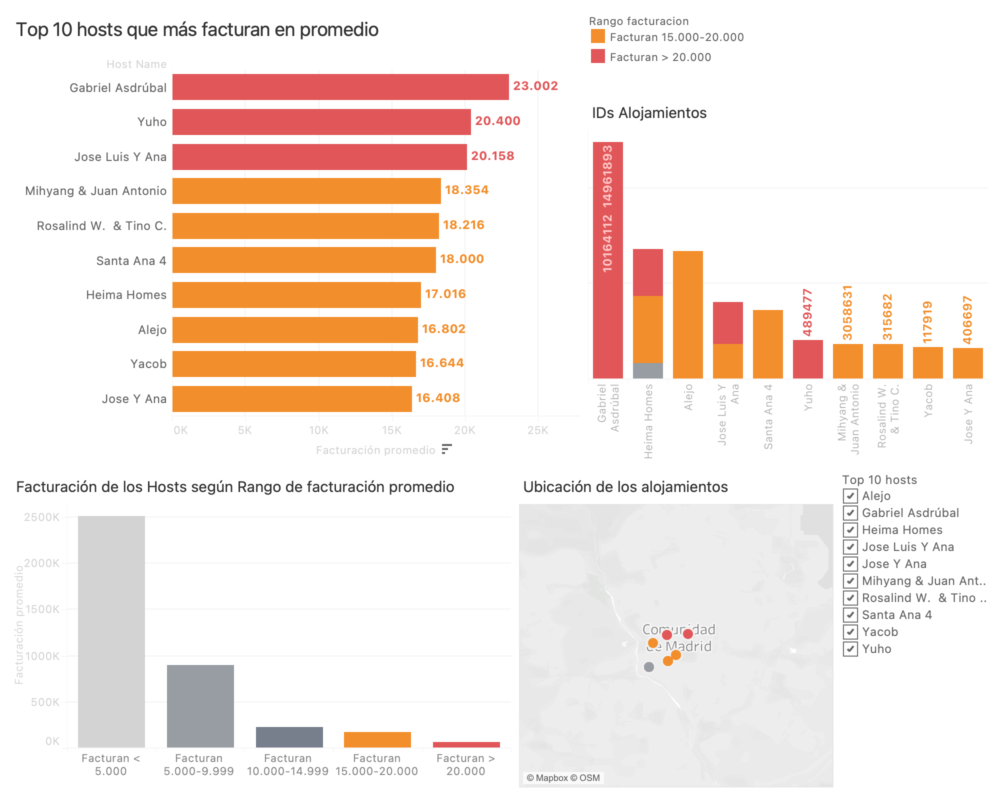

<h1 align="center">Análisis de Hosts con mayor facturación en Madrid</h1>

  
  

 

Este proyecto tiene como objetivo identificar a los hosts más rentables en la ciudad de Madrid, utilizando <strong>visualizaciones interactivas</strong> desarrolladas en <strong>Tableau</strong>. El análisis permite evaluar la concentración de ingresos, la ubicación geográfica de los alojamientos y los factores asociados al éxito económico de ciertos perfiles de host.

 

## Tabla de contenidos

- [Objetivo del proyecto](#objetivo-del-proyecto)
- [Fuentes de datos](#fuentes-de-datos)
- [Metodología](#metodología)
- [Visualizaciones clave](#visualizaciones-clave)
- [Principales insights](#principales-insights)
- [Conclusiones](#conclusiones)
- [Dashboard interactivo](#dashboard-interactivo)

## Objetivo del proyecto

Analizar la **facturación promedio** de los hosts de Airbnb en Madrid y establecer un **ranking de los 10 hosts más rentables**. Esto permite proponer estrategias de retención y mejora de la plataforma para los superhosts, así como entender su localización y perfil.

## Fuentes de datos

Se utilizaron dos datasets en formato CSV:

1. `airbnb-listings-madrid.csv` – Contiene 10.243 registros y 89 campos sobre alojamientos en Madrid.
2. `nveces_alquilado.csv` – Número promedio de veces que cada alojamiento fue alquilado.

Ambos fueron combinados en Tableau a través del campo `Host_ID`.

## Metodología

- Se creó un campo calculado para estimar la **facturación promedio**:

  `AVG(Price) * AVG(Nº veces alquilado)`

- Se categorizó a los hosts según rangos de facturación para entender su distribución.
- Se analizaron los alojamientos de los hosts top 10 y su ubicación en el mapa.
- Se incluyeron detalles adicionales como número de reviews y valoración media en los tooltips.

## Visualizaciones clave

- **Ranking de los 10 hosts con mayor facturación promedio**
  - Gráfico de barras horizontal.
  - Se han agrupado por rangos de facturación.
- **Relación entre hosts y sus IDs de alojamiento**

  - Identificación de IDs de alojamientos.
  - Permite evaluar la diversificación del ingreso por alojamiento.

- **Distribución por rango de facturación**
  - Gráfico de distribución.
  - Agrupa todos los hosts en cinco tramos:
    - `< 5.000€`
    - `5.000–9.999€`
    - `10.000–14.999€`
    - `15.000–20.000€`
    - `> 20.000€`
  - Permite entender la **curva de ingresos** y la proporción de superhosts.
- **Mapa geográfico**
  - Muestra la ubicación de los alojamientos de los principales hosts.
  - Visualización de concentración geográfica en zonas de alta rentabilidad.
  - Se ha utilizado el campo `neighbourhood` para la ubicación.

 

 

## Principales insights

- Gabriel Asdrúbal es el host con mayor facturación promedio estimada, seguido de Yuho y José Luis y Ana.
- La mayor parte de los hosts factura menos de 5000€ anuales, pero un pequeño grupo concentra ingresos elevados.
- Los hosts más rentables suelen tener múltiples alojamientos o una alta rotación.
- La zona de **Recoletos (28001)** concentra alojamientos de alto rendimiento.

## Aplicabilidad Estratégica

Este análisis permite a la empresa tomar decisiones como:

- Proponer un **sistema de incentivos** o comisiones preferentes para superhosts.
- Identificar **patrones geográficos de éxito** y replicarlos.
- Detectar oportunidades de expansión o inversión local.
- Comunicar **recomendaciones personalizadas** a hosts en crecimiento.

## Limitaciones y Consideraciones

- El análisis depende de la calidad del dato _"nº veces alquilado"_, que es una estimación y puede variar en el tiempo.
- No se ha segmentado por tipo de alojamiento (habitaciones privadas, pisos completos, etc.), lo cual podría ser una mejora futura.
- Las fechas de los datos son limitadas a un snapshot del año **2017**; podría enriquecerse con histórico temporal.

## Conclusiones

Este análisis demuestra cómo, a través de herramientas como **[Tableau](https://www.tableau.com/es-es)** y el uso de fuentes de datos públicas, se puede generar una visualización clara, interactiva y útil para evaluar el rendimiento económico de hosts en una plataforma como [Airbnb](https://www.airbnb.es/).

## Dashboard interactivo

Accede a la visualización publicada en Tableau Public:

🔗 [Ver Dashboard en Tableau Public](https://public.tableau.com/views/Top10hostsmayorfacturacinMadrid/Dashboard1?:language=es-ES&publish=yes&:sid=&:redirect=auth&:display_count=n&:origin=viz_share_link)

